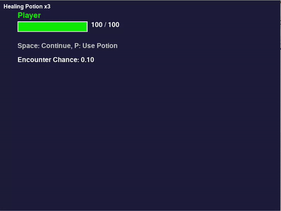

# Turn-Based Pygame Adventure

A lightweight turn-based RPG prototype built with [Pygame](https://www.pygame.org/).
Explore, find loot, and battle endless waves of enemies in a classic “explore → encounter → battle” gameplay loop. Built around a modular finite-state machine and percentage-based character progression.



## Core Mechanics

This game blends classic RPG elements with modern mechanics. For a deep dive into the architecture and design choices, see the [Architecture & Mechanics Overview](docs/overview.md).

*   **Exploration & Encounters:** Press **E** to explore. Each step increases the chance of a random enemy encounter, which resets after a battle. You might also find items or gold.
*   **Turn-Based Battle:** Combat is strategic, with a focus on managing Stamina. You can attack, defend to regain stamina and halve incoming damage, or attempt to flee.
*   **Always-Visible Inventory:** Your first nine item groups are always visible and usable via number keys (**1-9**), both in and out of combat. See the [Always-Visible Inventory Spec](docs/always_visible_inventory.md) for details.
*   **Experience (XP) & Gold:** The game uses two currencies. **Gold** buys consumables, while **XP** is spent on permanent, percentage-based upgrades. [Read more on the economy](docs/experience_and_currency.md).
*   **Permanent Boosts:** Instead of small, flat bonuses, you can buy repeatable, percentage-based upgrades for damage and health. The cost for these boosts scales exponentially. [Read the Boosts Rework Plan](docs/boosts_rework_plan.md).
## Gameplay Overview

1.  **Explore** – Press **E** to take a step. Each step may trigger an enemy encounter or uncover an item.
2.  **Battle** – When an encounter starts, you fight in a turn-based system.
    *   **A** – Attack the enemy (costs 1 stamina).
    *   **D** – Defend to halve the next hit and recover 1 stamina.
    *   **F** – Attempt to flee the battle.
    *   **1-9** – Use an item from your quick-slots.
3.  **Upgrade** – After winning battles, spend your earned XP and Gold at the shop for permanent boosts and consumable items.
4.  If your HP drops to zero, the game ends.

## Controls

| Key     | Context          | Action                           |
|---------|------------------|----------------------------------|
| `E`     | Explore          | Take a step / Advance            |
| `A`     | Battle           | Attack the enemy                 |
| `D`     | Battle           | Defend (reduces damage, adds stamina) |
| `F`     | Battle           | Attempt to flee                  |
| `1`-`9` | Explore & Battle | Use item in corresponding slot     |
| *Window close* | Any       | Quit game                        |

## Design & Mechanics Docs

The `docs/` directory contains detailed design specifications for key game systems.

| Topic                      | File                                                 |
|----------------------------|------------------------------------------------------|
| **Architecture Overview**  | [docs/overview.md](docs/overview.md)                 |
| Always-Visible Inventory   | [docs/always_visible_inventory.md](docs/always_visible_inventory.md) |
| Boosts & Upgrades        | [docs/boosts_rework_plan.md](docs/boosts_rework_plan.md)     |
| Experience & Currency      | [docs/experience_and_currency.md](docs/experience_and_currency.md) |
| Finite-State Machine (FSM) | [docs/fsm_spec.md](docs/fsm_spec.md)                 |
| Inventory Grouping         | [docs/inventory_grouping_plan.md](docs/inventory_grouping_plan.md)|

## Installation

### Prerequisites

* Python **3.10** or newer
* Pygame **2.x**

### Quick start

```bash
# (recommended) create a virtual environment
python -m venv venv
source venv/bin/activate  # Windows: venv\Scripts\activate

# install dependencies
pip install pygame
```

> Optionally, add other libs to `requirements.txt` and use `pip install -r requirements.txt`.

## Running the Game

```bash
python -m src.main
# or
python src/main.py
```

A window titled *Turn-Based Game* should appear – play with the keys above!

## Project Structure

```
src/
├── abilities/          # Modular ability classes (attacks, etc.)
├── core/
│   ├── game.py         # Main loop, state machine, Pygame setup
│   ├── game_state.py   # Enum & StateManager helper
│   ├── events.py       # Maps Pygame events to high-level signals
│   └── ui.py           # Rendering helpers (health bars, text, battle screen)
├── entities/
│   ├── base.py         # Base Entity class
│   ├── player.py       # Player implementation & inventory
│   └── enemy.py        # Enemy implementation with scaling
├── items/              # Collectable items (HealingPotion, GoldPile)
├── states/
│   ├── explore.py      # Exploration state logic & rendering
│   └── battle.py       # Battle state logic & rendering
├── config.py           # All tunable constants (screen size, colours, combat stats)
├── utils.py            # Utility helpers (e.g., battle log)
└── main.py             # Thin entry point that runs Game
```

## Contributing

Contributions are welcome! To propose a change:

1. Fork the repository & create a feature branch.  
2. Commit your changes with clear messages.  
3. Open a Pull Request describing *what* and *why*.

Please follow [PEP 8](https://peps.python.org/pep-0008/) style and include docstrings where relevant.

## License

This project is licensed under the **MIT License** – see [`LICENSE`](LICENSE) for details.

## Acknowledgements

Built with [Pygame](https://www.pygame.org/) in collaboration with LLM agents.