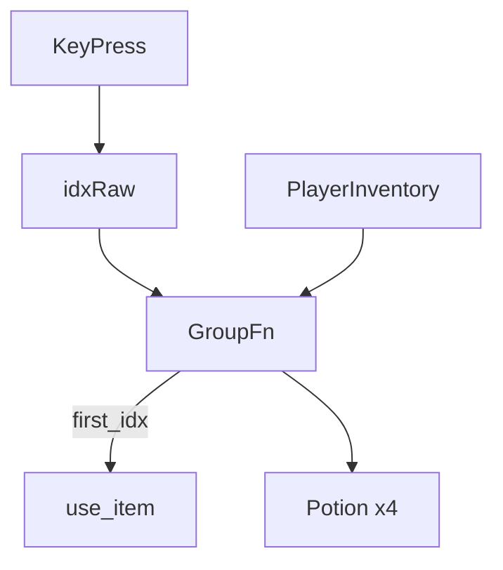

# Inventory Grouping Plan

This document outlines the approach for grouping identical items in the inventory when the player is prompted to choose an item to use.

## Goals
1. Group identical items so each appears only once in the selection menu.  
2. Display the quantity, e.g. `Potion of Healing x4`.  
3. Keep the underlying `player.inventory` as a flat list—no data-model changes required.

## Implementation Steps

### 1. Grouping Helper
- Add `group_inventory(inventory) -> list[tuple[item, int, int]]` in [`src/utils.py`](relative/src/utils.py:1).  
  • Returns `(item_obj, qty, first_idx)` preserving order of first appearance.  
- Utilise `collections.OrderedDict` or manual loop to tally quantities.

### 2. Update UI Rendering
- Modify [`UI.render_item_menu`](relative/src/core/ui.py:200).  
- Build menu entries from `group_inventory`.  
- Format: `"(1) Potion of Healing x4: Heals 50 HP"` (omit “x1” for singletons).

### 3. Update Item Use Handling
- Modify [`handle_item_use`](relative/src/utils.py:52).  
- Build the grouped list.  
- Validate pressed index against `len(grouped)`.  
- Map displayed index → `first_idx`, invoke `player.use_item(first_idx)`.

### 4. Integration
- Other states (`BattleState`, `ExploreState`, shop, etc.) call existing UI/helper functions, so they automatically benefit.  
- No changes needed to save/load or shop logic.

## Diagram

## Acceptance Criteria
- Selecting a potion when 4 duplicates exist consumes one and refreshes menu to show `x3`.  
- No duplicate entries appear in any item selection menu.  
- All existing battles, shops, and exploration flows continue to function without regression.