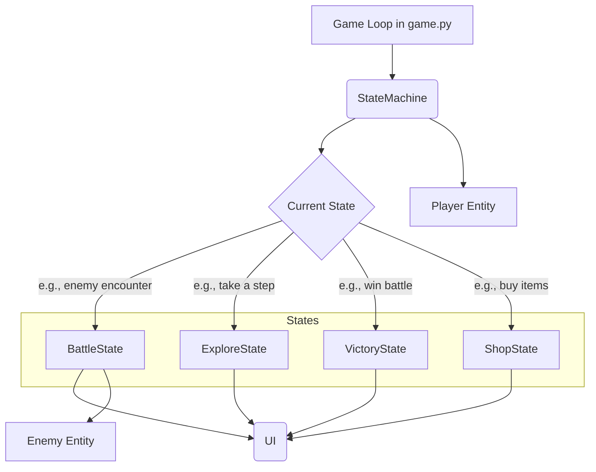
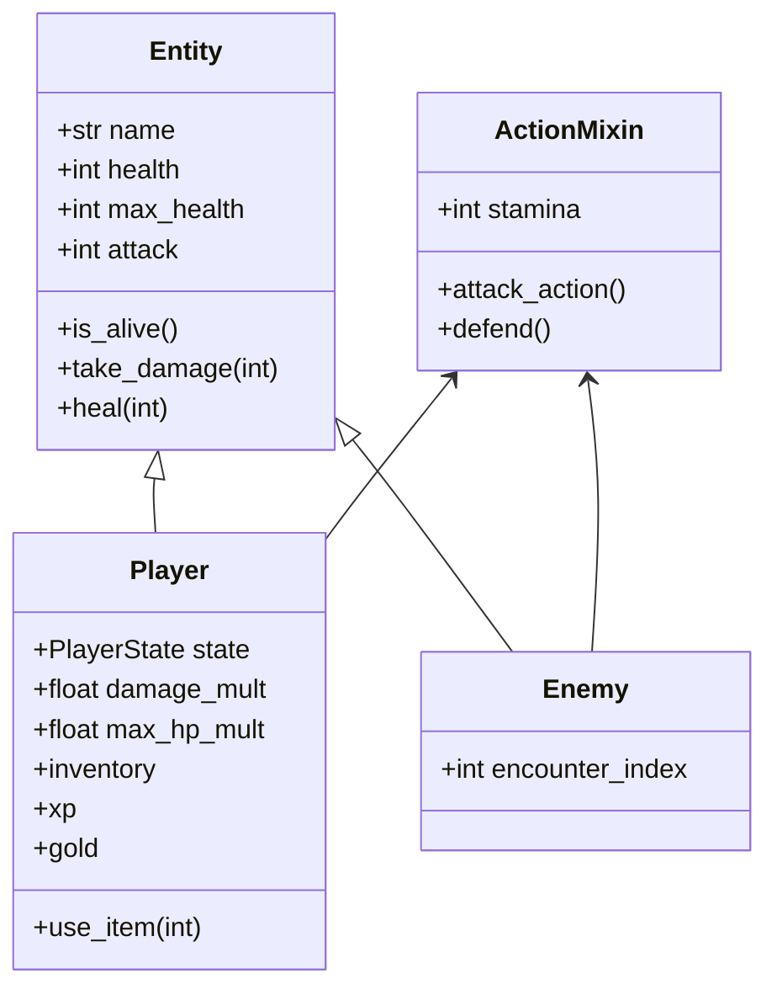

# Architecture & Mechanics Overview

This document provides a high-level tour of the game's technical design and core mechanics. For deeper dives, see the other files in this `docs/` directory.

## Core Architecture

The game is built around a simple but robust architecture that separates different game phases into distinct states, managed by a central state machine.

*   **[`src/core/game.py`](../src/core/game.py)**: Contains the main `Game` class that initializes Pygame, runs the main loop, and holds the `StateMachine` instance.
*   **[`src/core/state_machine.py`](../src/core/state_machine.py)**: A simple Finite State Machine (FSM) that manages transitions between different game states (e.g., `ExploreState`, `BattleState`). See the [FSM Spec](fsm_spec.md) for full details.
*   **[`src/states/*.py`](../src/states/)**: Each file defines a `BaseState` subclass responsible for a specific part of the game (exploring, battling, shopping, etc.).
*   **[`src/core/ui.py`](../src/core/ui.py)**: A collection of helper functions for rendering UI elements like health bars, text, and inventory lists.

## Entity Hierarchy

Entities are the primary actors in the game, from the player to the enemies they fight.

*   **[`src/entities/base.py`](../src/entities/base.py)**: The `Entity` class provides fundamental attributes like `health`, `attack`, and methods for taking damage.
*   **[`src/entities/mixins.py`](../src/entities/mixins.py)**: The `ActionMixin` provides combat-related functionality like `stamina` and the `attack_action` and `defend` methods.
*   **[`src/entities/player.py`](../src/entities/player.py)**: The `Player` class, which combines `Entity` and `ActionMixin`, and adds player-specific state like `xp`, `gold`, and `inventory`.
*   **[`src/entities/enemy.py`](../src/entities/enemy.py)**: The `Enemy` class, which also uses `Entity` and `ActionMixin`, with stats that scale based on the `encounter_index`.

## Core Mechanics

### Abilities & Stamina

The battle system is resource-driven, centered around Stamina.

*   **Stamina:** Most actions in combat, like attacking, cost Stamina. The player and enemies start with a maximum stamina defined in `config.py`.
*   **Attacking:** A standard attack costs 1 stamina. If an entity has no stamina, they cannot attack.
*   **Defending:** The **Defend** action (`D` key) does not cost stamina; instead, it regenerates 1 stamina. While defending, the entity takes half damage from the next incoming attack. This makes defending a critical tactical choice to recover stamina and mitigate damage.
*   **[`src/abilities/*.py`](../src/abilities/)**: Defines modular abilities. For instance, `PlayerAttackAbility` encapsulates the logic for calculating player damage, including critical hits and multipliers.

### Exploration & Encounters

The "overworld" gameplay takes place in the `ExploreState`.

*   **Taking a Step:** Pressing the Explore key (`E`) constitutes one turn.
*   **Encounter Chance:** Each step has a chance to trigger a battle. This probability starts at `BASE_ENCOUNTER_CHANCE` and increases with each safe step (`ENCOUNTER_INCREMENT`), resetting after an encounter occurs.
*   **Finding Items:** There is also a `ITEM_FIND_CHANCE` on each step to discover a random item, like a `HealingPotion` or a `GoldPile`.

### Inventory & Items

The player's inventory is managed for simplicity and quick access.

*   **Grouped Inventory:** The UI automatically groups identical items, showing a quantity instead of a long list (e.g., "Healing Potion x3"). This is handled by **[`group_inventory()`](../src/utils.py)**.
*   **Always-Visible Quick-Slots:** The first 9 item groups are always displayed on-screen.
*   **Numbered Hotkeys:** Pressing keys `1` through `9` instantly uses the corresponding item in the visible list, whether in exploration or battle. The logic is managed by **[`handle_item_use()`](../src/utils.py)**.
*   [See full spec: Always-Visible Inventory](always_visible_inventory.md)

### Experience (XP) & Gold

The game features two primary currencies:

*   **Gold:** Used to buy consumable items. Found during exploration.
*   **Experience (XP):** Used to buy permanent, percentage-based upgrades. Earned from winning battles.
*   [See full spec: Experience and Currency](experience_and_currency.md)

### Permanent Boosts

Instead of flat stat increases, players can purchase repeatable, percentage-based boosts from the shop.

*   **Scaling Cost:** The XP cost for each boost level increases exponentially, calculated by the **[`scaled_cost()`](../src/utils.py)** function.
*   **Example Boosts:** `DAMAGE_BOOST_PCT` (e.g., +5% damage per level) and `MAX_HP_BOOST_PCT` (e.g., +10% max HP per level).
*   [See full spec: Boosts Rework Plan](boosts_rework_plan.md)