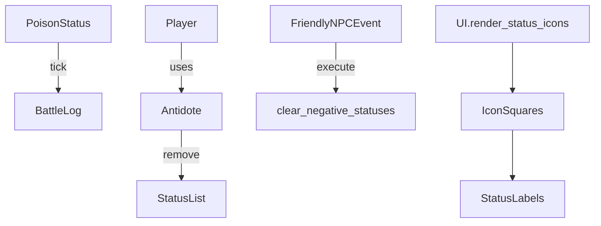

# Poison Feedback & Cure Roadmap

This document captures the agreed implementation plan to improve feedback and recovery from adverse status-effects — chiefly *poison* — in both gameplay and UI.

## Goals

1. Provide explicit battle-log feedback whenever poison (and other DoT) deals damage.  
2. Improve status visibility in the HUD with textual labels alongside existing coloured icons.  
3. Introduce a consumable **Antidote** item that removes negative statuses.  
4. Allow the *Friendly Traveler* mini-event to cure adverse effects.  
5. Add helper APIs on `Entity` to clear statuses.  
6. Extend test-suite to cover new behaviour.

## Technical Tasks

### 1 · Battle Log Messaging

* File: [`src/entities/status.py`](src/entities/status.py)  
* Change: In `PoisonStatus.on_turn_start()` call [`utils.add_to_log()`](src/utils.py) to write  
  `"{entity.name} suffers {damage} poison damage!"`.

### 2 · UI Indicator Upgrade

* File: [`src/core/ui.py`](src/core/ui.py)  
* Function: `render_status_icons()`  
* Add `UI.display_text()` directly beneath each icon square to show the status name (capitalised).

### 3 · Curative Item — Antidote

* File: [`src/items/items.py`](src/items/items.py)  
* Class: `Antidote(Item)`  
* `use()` implementation:  
  - call `entity.clear_negative_statuses()`  
  - log `"Cured all adverse effects."`  
* Add to `ItemFindEvent` loot table at low probability (e.g. 0.15 vs potions).

### 4 · Entity Helper

* File: [`src/entities/base.py`](src/entities/base.py)  
* Method: `clear_negative_statuses(self) -> int`  
  - defines `NEGATIVE_STATUSES = {"poison", "bleed", "stun"}`  
  - removes matching `Status` instances, returns count removed.

### 5 · FriendlyNPCEvent Enhancement

* File: [`src/events/mini_events.py`](src/events/mini_events.py)  
* In `FriendlyNPCEvent.execute()` call `player.clear_negative_statuses()` before healing.  
* Update description: `"A friendly traveler cures your wounds and ailments, restoring {heal} HP."`

### 6 · Tests

* Extend `tests/test_event_side_effects.py`  
  - verify poison tick writes to log  
  - ensure FriendlyNPCEvent removes statuses  
* New test for `Antidote` item.

## Mermaid Overview

## Estimated Effort

* Code changes: ~120 LOC  
* Tests: ~60 LOC  
* Risk: low-moderate (UI alignment, item balance)

---